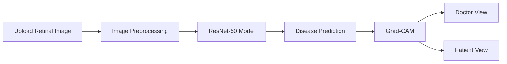

<div align="center">

# 👁️ AI-Based Diabetic Retinopathy Detection Using ResNet-50

### AI-powered retinal disease detection with Explainable AI (Grad-CAM)

<p align="center">
  
</p>


</div>

---

# 📖 Overview

Diabetic Retinopathy (DR) is one of the leading causes of blindness among diabetic patients. This project uses a **ResNet-50 Convolutional Neural Network** to automatically detect and classify diabetic retinopathy from retinal fundus images.

The system also integrates **Grad-CAM Explainable AI** to highlight the retinal regions that influenced the model's prediction, improving transparency and assisting healthcare professionals in diagnosis.

---

# 🎥 Demo

<p align="center">

</p>

---

# ✨ Features

- 👁️ Upload retinal fundus images
- 🧠 AI-powered diagnosis using ResNet-50
- 📊 Five-stage diabetic retinopathy classification
- 🔥 Explainable AI using Grad-CAM
- 👨‍⚕️ Dedicated Doctor Dashboard
- 🧑 Patient Dashboard with simplified diagnosis
- 📈 Confidence score prediction
- 🌐 Responsive Django web application

---

# 🧠 Workflow



---

# 🩺 Disease Classification

| Stage | Description |
|---------|------------|
| 🟢 No DR | Healthy Retina |
| 🟡 Mild | Small Microaneurysms |
| 🟠 Moderate | Blood Vessel Damage |
| 🔴 Severe | Extensive Retinal Damage |
| ⚫ Proliferative | Abnormal Blood Vessel Growth |

---

# 📸 Screenshots

## 🏠 Home Page

<p align="center">

</p>

---

## 👨‍⚕️ Doctor View

<p align="center">

</p>

---

## 🧑 Patient View

<p align="center">

</p>

---

## 🔥 Grad-CAM Visualization

<p align="center">

</p>

---

# ⚙️ Tech Stack

| Category | Technology |
|----------|------------|
| Language | Python |
| Backend | Django |
| Frontend | HTML, Tailwind CSS, JavaScript |
| AI Model | ResNet-50 |
| Explainable AI | Grad-CAM |
| Image Processing | OpenCV |
| Deep Learning | TensorFlow / PyTorch |
| Data Analysis | NumPy, Pandas |
| Visualization | Matplotlib |

---

# 📂 Project Structure

```text
📦 AI-Diabetic-Retinopathy-Detection

├── backend/
├── frontend/
├── templates/
├── static/
├── media/
├── model/
├── dataset/
├── screenshots/
│   ├── home.png
│   ├── doctor.png
│   ├── patient.png
│   └── heatmap.png
├── assets/
│   ├── banner.png
│   └── demo.gif
├── requirements.txt
└── README.md
```

---

# 🚀 Installation

```bash
# Clone repository

git clone https://github.com/yourusername/yourrepository.git

# Go to project

cd yourrepository

# Install dependencies

pip install -r requirements.txt

# Run server

python manage.py runserver
```

---

# 📊 Model Details

| Property | Value |
|----------|-------|
| Model | ResNet-50 |
| Input Size | 224 × 224 |
| Classes | 5 |
| Explainability | Grad-CAM |
| Framework | TensorFlow / PyTorch |

---

# 📈 Future Enhancements

- [x] ResNet-50 Classification
- [x] Grad-CAM Explainability
- [x] Doctor Dashboard
- [x] Patient Dashboard
- [ ] Mobile Application
- [ ] Multi-eye Disease Detection
- [ ] Cloud Deployment
- [ ] Electronic Health Record Integration

---

# 🤝 Contributing

Contributions are welcome!

1. Fork the repository
2. Create a feature branch
3. Commit your changes
4. Open a Pull Request

---

# 📜 License

This project is developed for educational and research purposes.

---

<div align="center">

### ⭐ If you found this project helpful, please consider giving it a star!

Made with ❤️ using Django, ResNet-50 & Grad-CAM

</div>
